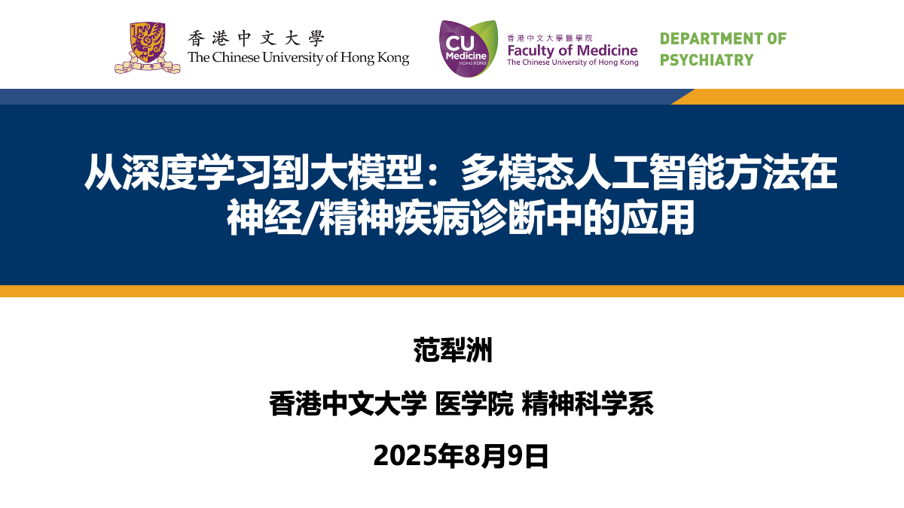

## 📅研究分享

我在会议上作了题为"**从深度学习到大模型：多模态人工智能方法在神经，精神疾病诊断中的应用**"的主旨报告。报告系统性地探讨了：

- 大语言模型和多模态AI在精神疾病风险预测与早期诊断中的潜力
- 人工智能技术在精神疾病个性化治疗方案制定中的前景与挑战

## 📋跨学科学术交流

会议汇集了来自精神医学、心理学、神经科学、人工智能等多个领域的专家。除我的"**从深度学习到大模型：多模态人工智能方法在神经/精神疾病诊断中的应用**"报告外，其他专家的分享也极具启发性，涵盖了"**智能影像基因组学与疾病诊断应用**"、"**精神卫生服务年：思考与实践**"、"**AI时代心理学科建设**"、"**从神经心理到神经调控**"、"**精神疾病的神经免疫和炎症机制**"、"**脑连接、脑网络与认知能力：以AD应用为例的一点思考**"、"**循四大培养举措，铸双型医学人才**"、"**抑制过度觉醒——失眠药物治疗新策略**"等主旨报告，围绕精神医学的前沿研究、学科发展、临床诊疗等多方面内容展开探讨，切实推动精神医学领域的创新发展，提升精神疾病的综合防治水平，守护全民心理健康。

---