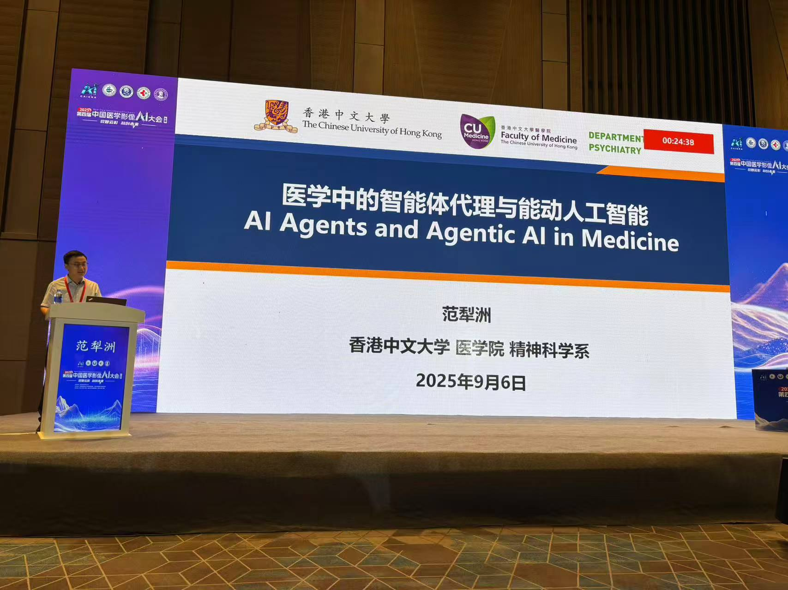
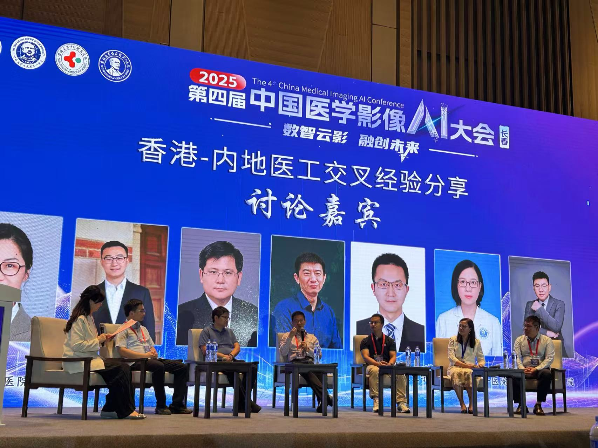

## 📅研究分享

我在会议上作了题为"**医学中的智能体代理与能动人工智能**"的学术报告。报告系统性地探讨了：

- 智能体代理与能动人工智能在医学影像分析与诊断中的潜力
- AI技术在医学影像个性化诊疗方案制定中的前景与挑战

## 📋跨学科学术交流

会议汇集了来自医学影像、人工智能、临床医学等多个领域的专家。除我的"**医学中的智能体代理与能动人工智能**"报告外，其他专家的分享也极具启发性，涵盖了"**医生主导·智领变革**"、"**医工融合·技术跃迁**"、"**双城对话·融汇发展**"等核心议题，围绕医学影像AI的前沿研究、技术突破、临床转化等多方面内容展开探讨，切实推动医学影像AI领域的创新发展，促进AI技术下沉至县域基层，真正实现"医疗普惠"。

---