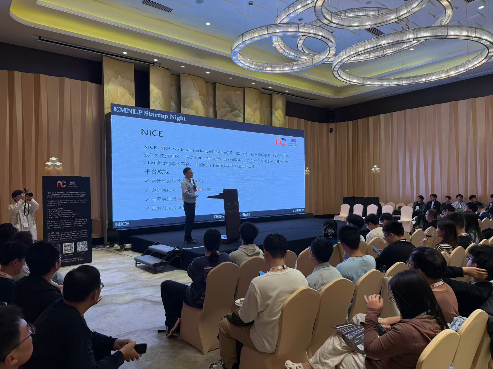

---
title: "EMNLP NICE Startup Night"

summary: 受主办方邀请担任 EMNLP NICE Startup Night 主持人，与学界、产业界及创投伙伴围绕生成式 AI 的创新边界与真实落地展开深度对话。

abstract: >
  EMNLP NICE Startup Night 是 EMNLP 的重要卫星活动之一。受主办方邀请担任本次活动主持人，与来自学界、产业界与投资领域的嘉宾围绕生成式人工智能、具身智能与医疗健康等方向展开交流。本次活动旨在促进学术创新与产业实践之间的对话，探讨技术走向现实世界的路径与挑战。

date: '2025-11-05T10:00:00Z'
date_end: '2025-11-05T15:00:00Z'
all_day: false

publishDate: '2025-11-06T00:00:00Z'

authors: ["fanlizhou"]

tags: ["EMNLP", "Generative AI", "Startup", "AI + Healthcare", "Embodied AI"]

featured: true

image:
  caption: "EMNLP NICE Startup Night 官方海报"
  focal_point: Center

url_code: ''
url_pdf: ''
url_slides: ''
url_video: ''

slides: ""
projects: []
---

## 一、从学术高地到真实世界

EMNLP NICE Startup Night 是 EMNLP 的重要卫星活动之一，旨在构建一个深度产学研结合的研讨平台。

EMNLP 代表着自然语言处理与人工智能研究的前沿高度，而 Startup Night 则关注一个更为现实的问题：当学术成果发表之后，技术如何真正走向社会。

受主办方邀请担任本次活动主持人，参与活动组织与现场主持工作。活动的目标在于构建一个开放的对话空间，使研究者、创业者与投资人能够在同一语境下交流判断、分享经验、形成共识。学术创新与产业实践之间，应建立更为紧密的联结。

---

## 二、多元视角下的生成式 AI 生态

本次活动邀请了多位活跃在学术与产业一线的嘉宾参与交流：

- **穆尧（Yao Mu）** —— 上海交通大学教授，长期从事多模态学习与 AIGC 研究  
- **付杰（Tie Fu）** —— Shanghai AI Lab 青年科学家，推动 Human-Friendly Big AI Dream  
- **高雅君（Yajun Gao）** —— 专注生成式 AI 与医疗健康交叉方向  
- **杨景宇（Jingyu Yang）** —— 连续创业者，长期深耕人工智能产业化  

不同背景的视角使讨论更加立体。从基础模型能力，到具身智能的落地可能性；从医疗健康的真实需求，到创业过程中面临的资本与产品决策问题，讨论始终围绕生成式 AI 如何真正创造价值这一核心展开。

---

## 三、关于机遇、挑战与未来

在生成式人工智能快速演进的时代背景下，机遇与挑战并存。

具身智能正在重塑人与机器的互动方式；  
医疗健康领域正因多模态模型与数字表型技术的发展而面临重构；  
知识生产与创新门槛正在被显著降低。

与此同时，技术可靠性、伦理边界、可持续商业模式以及社会责任，也成为无法回避的重要议题。

人工智能真正值得期待的方向，不在于模型规模的扩张，而在于其能否成为一种普惠科技——帮助更多人获得医疗资源、教育资源与创新机会，而非仅停留在技术展示或资本叙事之中。

期待在未来，能够涌现更多跨越学术与产业边界的实践，让人工智能真正服务于人类社会，推动突破边界的创新发生。

---

## 🔗 活动原始详情页面

  <a href="https://mp.weixin.qq.com/s/U1hasfiy5F1sL8VQuqKq9Q" target="_blank" style="display:inline-block;padding:10px 18px;background-color:#111;color:white;text-decoration:none;border-radius:6px;font-weight:600;">
    查看原始活动页面
  </a>

