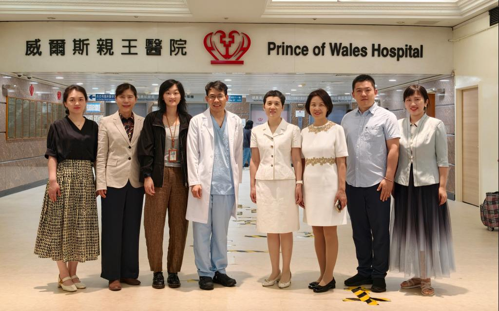
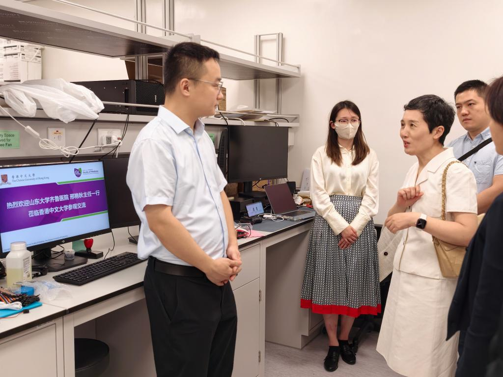
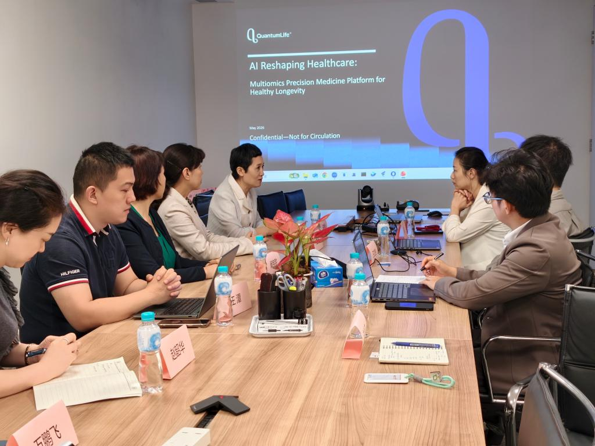

## 交流概况

2026年6月22日至24日，山东大学齐鲁医院保健科（老年医学科）专家团队赴香港开展学术访问。此次访问聚焦老年医学学科建设与前沿技术融合，围绕医疗人工智能、老年康养、长寿医学等方向，与香港地区医疗及科研机构开展深入交流。

访问团队先后走访香港中文大学威尔斯亲王医院、香港中文大学精神科学系和香港量子人工智能实验室，围绕结构性心脏病诊疗、智慧老年健康管理、AI多组学长寿医学等主题进行对接，进一步拓展鲁港两地在医疗科研与临床转化方面的合作空间。

## 老年心血管与临床诊疗交流

在香港中文大学威尔斯亲王医院，齐鲁医院访问专家与香港中文大学医学院相关团队围绕老年结构性心脏病诊疗、心脏瓣膜微创手术、新型医械材料应用和心脏康复 AI 诊断等方向展开研讨。

双方还围绕老年患者手术风险评估、个体化诊疗方案制定及结构性心脏病介入手术临床实践等议题进行交流，为后续在老年心血管疾病精细化诊疗方面的合作奠定基础。

## 智慧老年健康管理

在香港中文大学医学院精神科学系，访问团队观看了 CBTI 睡眠管理机器人、具身智能睡眠监测辅助机器人等应用演示，并与范犁洲教授团队围绕老年智慧医疗场景落地展开交流。

交流重点包括无接触式睡眠监测技术在老年病房中的应用、独居老年群体居家健康管理服务模式，以及老年睡眠障碍、认知功能障碍等方向的科研合作机会。

## 长寿医学与人工智能前沿

在香港量子人工智能实验室，双方围绕老年长寿机制研究、人工智能在衰老干预中的前沿应用、量子计算与 AI 模型在长寿医学中的潜在价值展开讨论。

齐鲁医院保健科（老年医学科）也介绍了即将成立的“长寿门诊”建设设想。此次交流为长寿医学从基础研究走向临床转化提供了新的合作方向，也为 AI+老年医学的未来发展带来启发。

## 合作展望

此次赴港访问搭建了山东大学齐鲁医院保健科（老年医学科）与香港相关医疗、科研机构之间的交流桥梁。未来，双方有望在智慧老年健康管理、老年睡眠障碍、认知功能障碍、长寿医学和医疗人工智能临床转化等方向持续深化合作。

## 原文链接

  <a href="https://www.qiluhospital.com/show-26-45311-1.html" target="_blank" style="display:inline-block;padding:10px 18px;background-color:#1f4e79;color:white;text-decoration:none;border-radius:6px;font-weight:600;">
    点击查看山东大学齐鲁医院官网原文
  </a>

