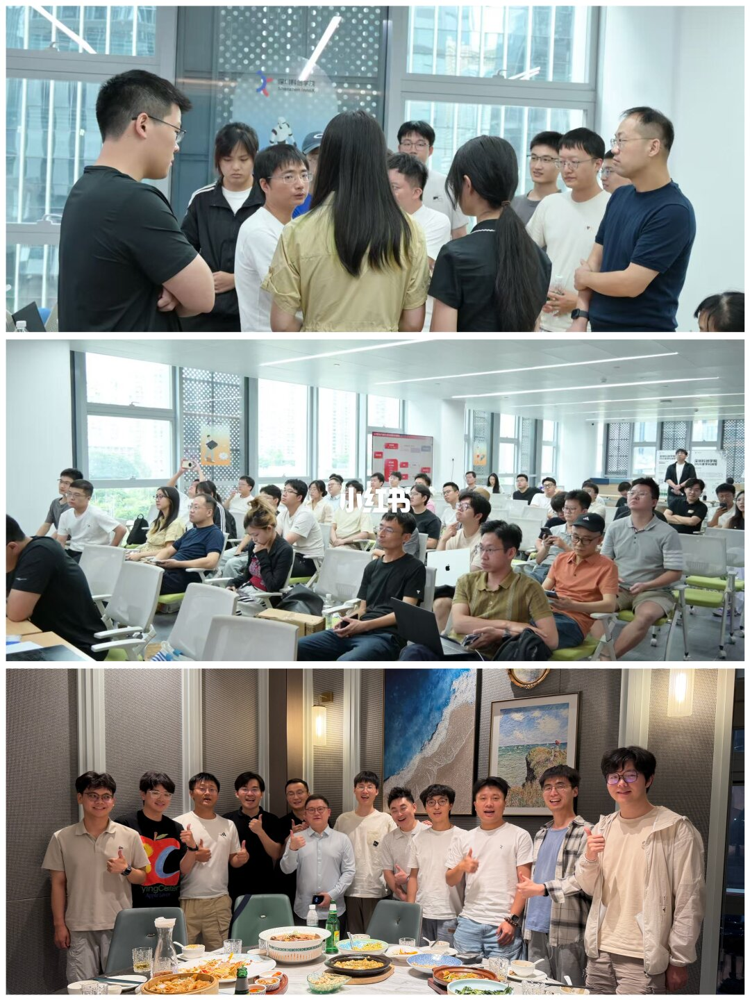
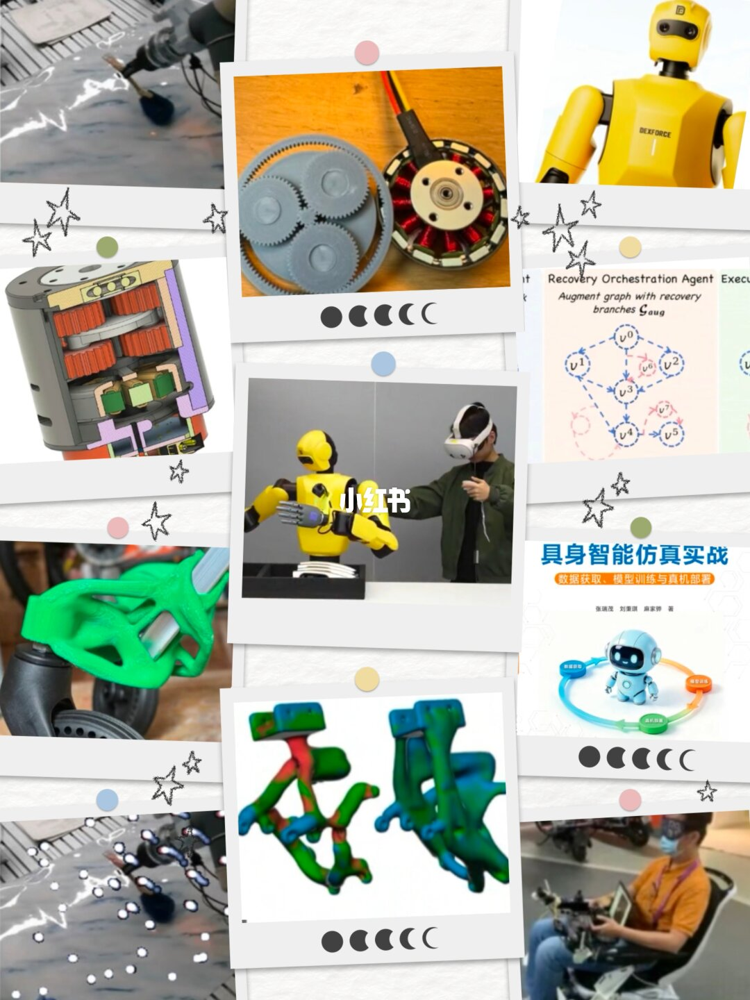
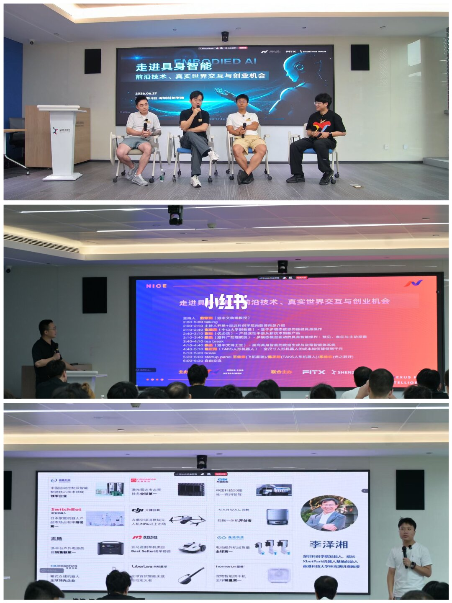
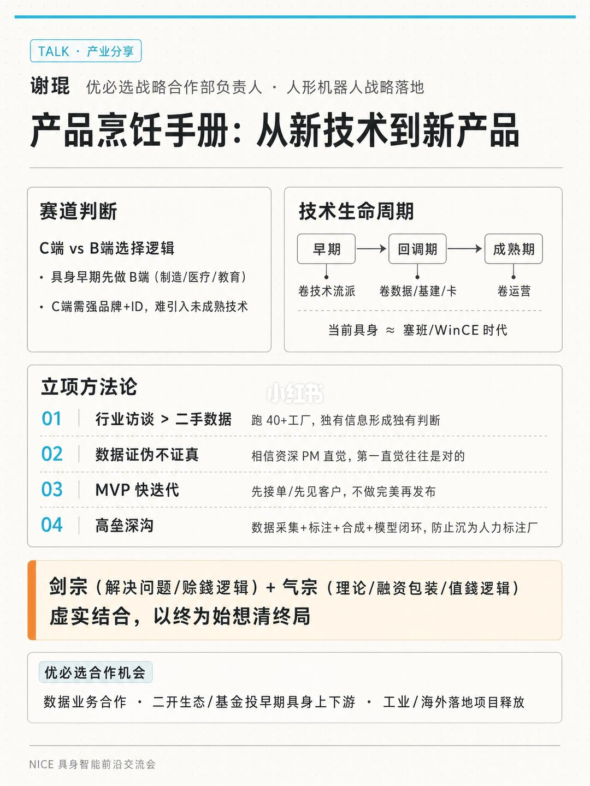
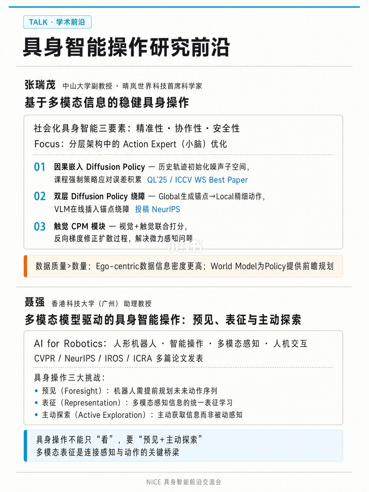
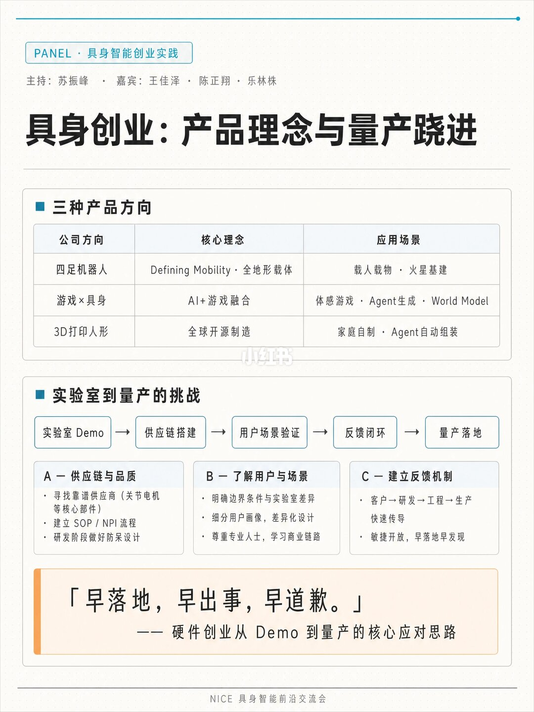
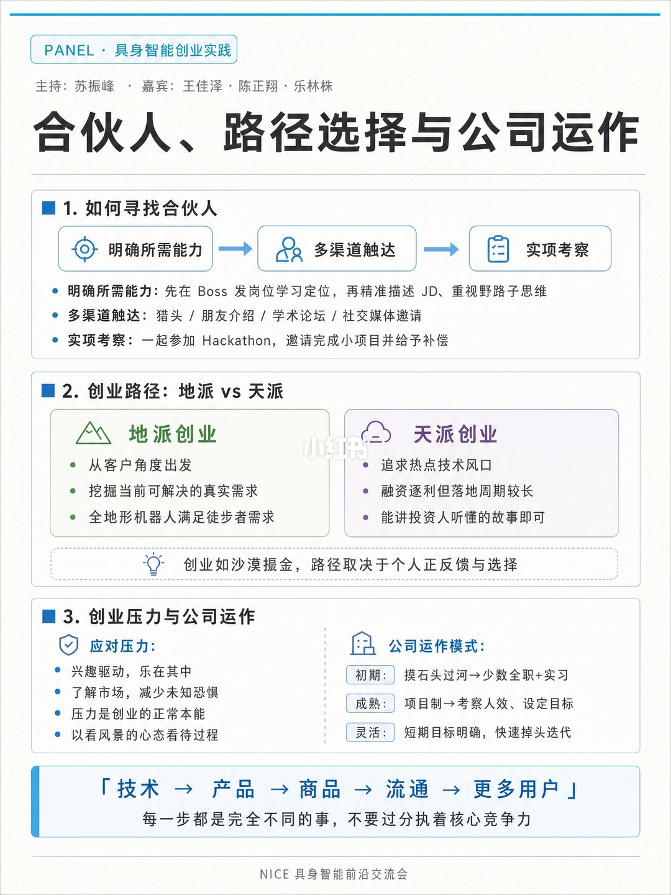
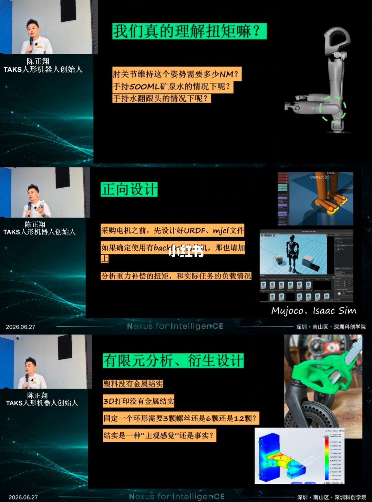
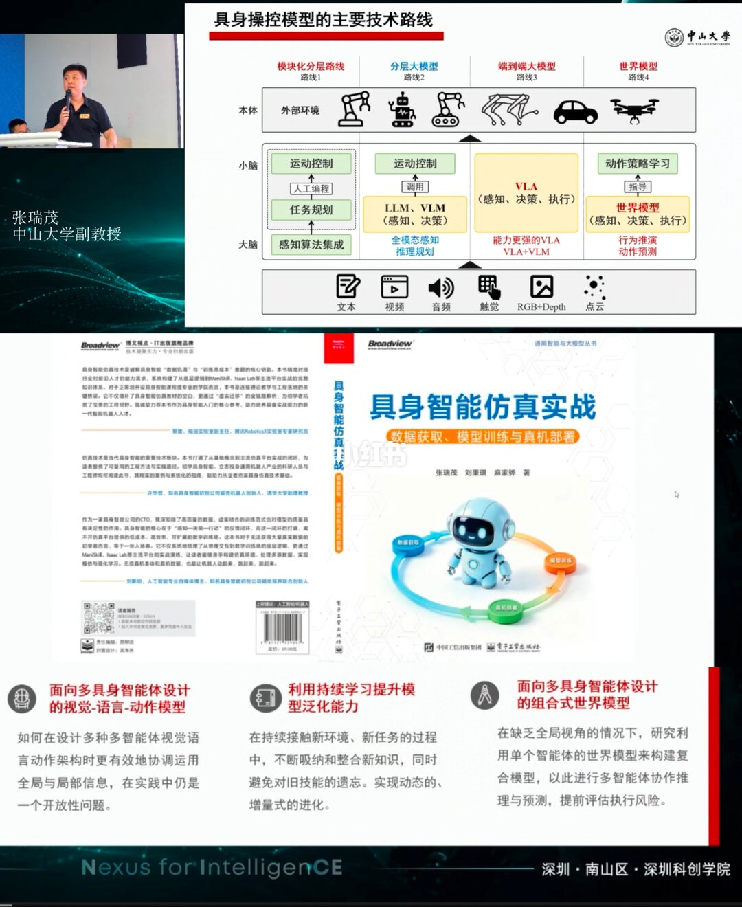
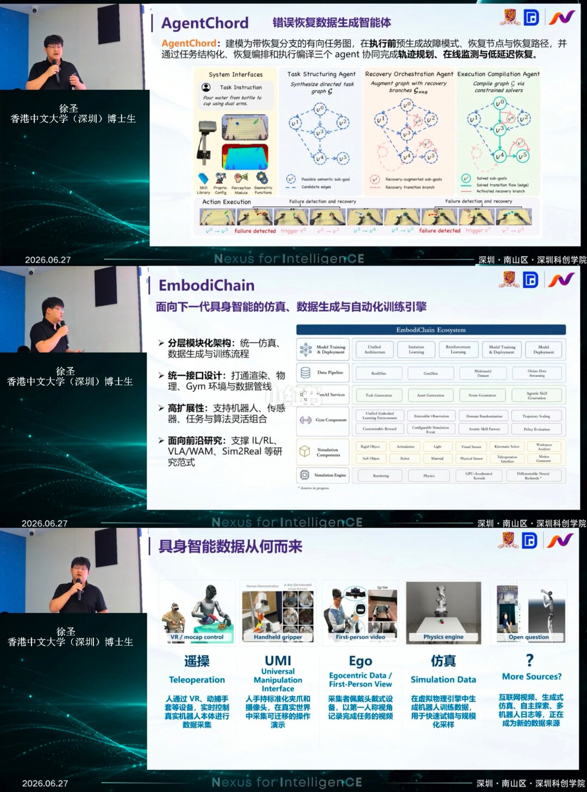

## 活动概况

我受 NICE 邀请参加在深圳举办的具身智能前沿技术与创业机会研讨会。活动围绕“具身智能如何从实验室走向真实产品”这一核心问题展开，讨论既覆盖学术前沿，也延伸到产业落地、创业组织、供应链管理和硬科技孵化等实践议题。

本次线下活动由 NICE 学术组织发起，并得到飞拓星驰与深圳科创学院支持。活动现场汇集了高校研究者、机器人产业从业者、创业团队和 AI 社群成员。这次交流很有价值的一点，是把具身智能的算法问题、工程问题和创业问题放在同一个语境中讨论，而不是只停留在单一技术展示上。

## 技术前沿与产业落地

在学术前沿部分，多位嘉宾围绕 Action Expert 分层架构、高质量数据生产管线、因果规划、触觉融合以及 World Model 等方向展开分享。这些议题都指向一个关键问题：具身智能系统如何从感知、决策到行动形成更可靠的闭环能力。

在产业落地部分，讨论进一步延伸到 B 端立项方法论、机器人产品量产、供应链协同和品控体系建设。相比单纯 Demo 展示，现场更关注这些系统真正进入应用场景时会遇到的问题：稳定性、维护成本、场景定义、用户预期和商业闭环，往往决定了技术能否持续产生价值。

## 创业实践与产品探索

活动也集中讨论了具身智能创业中的关键问题，包括博士创业团队如何寻找互补型合伙人、技术驱动与产品驱动之间如何平衡，以及消费级机器人产品如何找到真实需求。AI 和机器人领域的创业并不只是“把模型做好”，还需要非常扎实地理解场景、供应链和组织能力。

现场案例涵盖全地形四足机器人、3D 打印人形机器人、AI 游戏 Agent 等方向。不同团队的路径并不相同，但都体现了具身智能创业从算法、硬件、交互到商业模式的多维探索。

## 嘉宾阵容

本次活动邀请了多位来自学术界与产业界的一线嘉宾参与交流，包括：

- 张瑞茂，中山大学副教授
- 谢琨，优必选战略负责人
- 聂强，香港科技大学（广州）
- 徐圣，香港中文大学（深圳）
- Rex 陈正翔，TAKS 创始人
- 王佳泽，飞拓星驰创始人
- 乐林株，光之跃迁创始人
- 范犁洲，香港中文大学

## Demo 与硬科技孵化

除主题分享外，活动现场还展示了机器人相关 Demo，并由深圳科创学院分享硬科技从 0 到 1 的孵化路径和夏季科创营资源。对于具身智能这样的强工程交叉方向，孵化体系、场地资源、产业网络和早期验证场景往往与模型和算法同样关键。

这场交流把技术路线、创业判断和产业资源放在同一张桌面上讨论，也让具身智能的“终局”问题变得更加具体：真正重要的不是停留在概念热度，而是走向可部署、可维护、可规模化的真实系统。

## 原文链接

  <a href="https://www.xiaohongshu.com/explore/6a427ba2000000002201481d" target="_blank" style="display:inline-block;padding:10px 18px;background-color:#1f4e79;color:white;text-decoration:none;border-radius:6px;font-weight:600;">
    点击查看 NICE 学术小红书原文
  </a>

