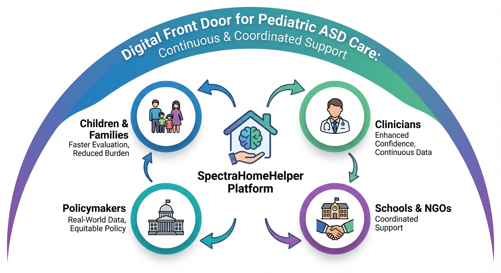
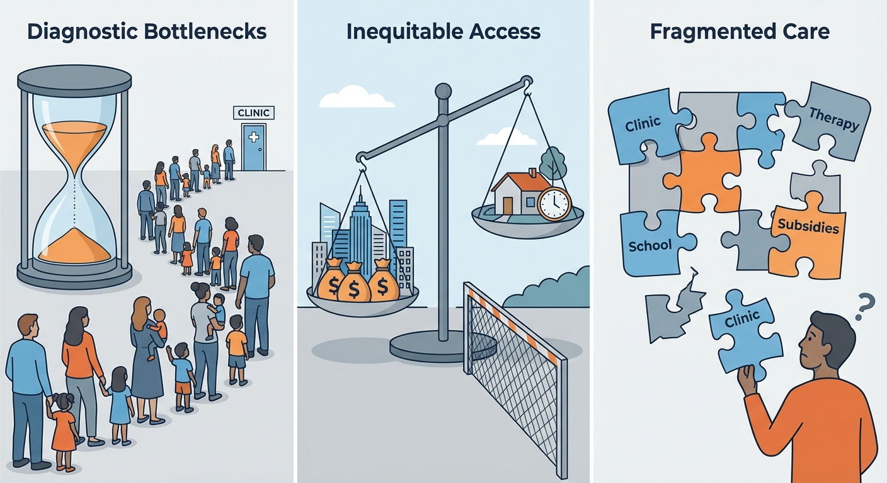
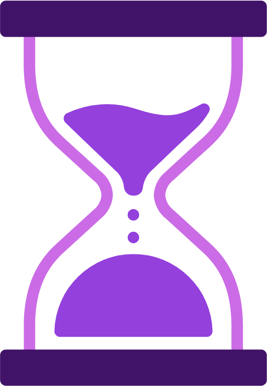
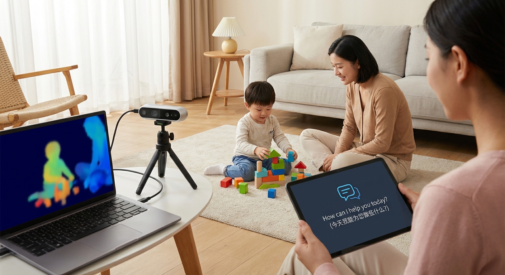
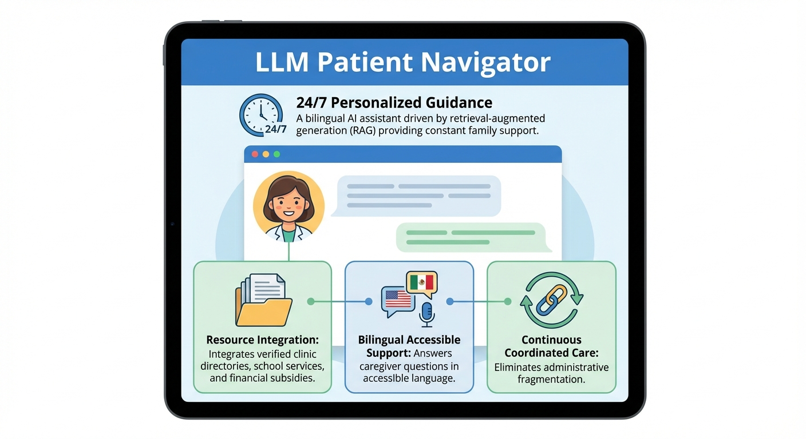
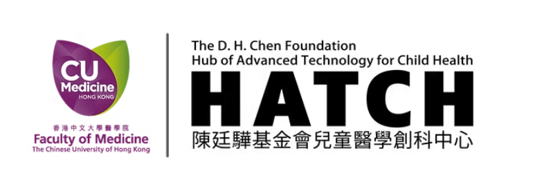
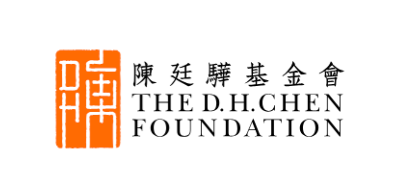

---
title: "KTIPF-ASD: SpectraHomeHelper"
date: 2024-11-14
type: landing

sections:
  - block: markdown
    content:
      title: ""
      text: |
        

        

          
        <!-- HERO SECTION -->
        <section class="med-hero">
        

        

        KTIPF-ASD Funded Innovation
        <h1>SpectraHomeHelper</h1>
        
Transforming Pediatric Autism Spectrum Disorders Healthcare with AI-powered Home Monitoring and Patient Navigation

        
以AI驅動的家庭監測和患者導引系統重塑兒童自閉症譜系障礙的醫療服務

        
        

        
        

        
SpectraHomeHelper is an integrated digital health solution combining AI home monitoring that prioritizes data privacy with a bilingual patient navigator driven by large language models. It provides continuous behavioral assessment and structured resource guidance for autistic children, shifting care from episodic visits to continuous support focused entirely on the family.

        
本項目致力於構建一個結合AI家庭行為監測與雙語大語言模型患者導引系統的創新數字醫療平台。它能夠為自閉症兒童提供連續的臨床級評估與結構化資源指導，以期待於實現高效、協調且以家庭為中心的普適化全面支持服務。

        

        <a href="#solution" class="med-btn med-btn-primary" style="padding: 16px 80px; font-size: 1.125rem; text-align: center;">Explore the Platform</a>
        

        

        

        </section>

        <!-- THE ISSUE SECTION -->
        <section class="med-section med-container fade-in-up">
        <h2 class="med-section-title">The "Triple Barrier" in ASD Care</h2>
        
Children with Autism Spectrum Disorder (ASD) in Hong Kong and mainland China encounter a persistent "triple barrier" when accessing care. 在香港和內地，自閉症兒童在獲取醫療服務時面臨嚴重的「三重障礙」。

        
        

        
        

        
        

        <!-- Card 1 -->
        

        

        
        

        <h3>Prolonged Waits 診斷瓶頸</h3>
        
Specialist clinics face massive waitlists, leaving children waiting months or years for evaluation. 專科門診面臨巨大診斷瓶頸，導致候診名單極長，患兒往往需等待數月至數年才能確診。

        

        <!-- Card 2 -->
        

        

        <svg fill="none" stroke="currentColor" viewBox="0 0 24 24" xmlns="http://www.w3.org/2000/svg"><path stroke-linecap="round" stroke-linejoin="round" stroke-width="2" d="M3.055 11H5a2 2 0 012 2v1a2 2 0 002 2 2 2 0 012 2v2.945M8 3.935V5.5A2.5 2.5 0 0010.5 8h.5a2 2 0 012 2 2 2 0 104 0 2 2 0 012-2h1.064M15 20.488V18a2 2 0 012-2h3.064M21 12a9 9 0 11-18 0 9 9 0 0118 0z"></path></svg>
        

        <h3>Unequal Access 資源分布不均</h3>
        
Disproportionately impacts low-income and non-urban families, who struggle to afford frequent clinic visits and transport. 醫療資源獲取存在顯著不平等，低收入和非城市家庭難以承擔頻繁就診的交通與時間成本。

        

        <!-- Card 3 -->
        

        

        
        

        <h3>Fragmented Coordination 護理碎片化</h3>
        
Families independently navigate complex guidelines, subsidies, and disjointed care settings, missing day-to-day variability. 照顧者必須獨自摸索複雜的醫療指南和補貼，且短暫的門診難以捕捉兒童日常行為的真實變化。

        

        

        

        This leads to delayed diagnoses, inconsistent follow-ups, elevated caregiver stress, and widening disparities in developmental outcomes. 這種現狀不僅導致了診斷和治療的延誤，給家庭帶來了極大的精神和經濟壓力，也進一步拉大了自閉症兒童在早期發育結果上的巨大差距。
        

        </section>

        

        <!-- SOLUTION SHOWCASE -->
        <section id="solution" class="med-section med-container fade-in-up">
        <h2 class="med-section-title">The Solution</h2>
        
We propose a comprehensive solution combining AI-powered home monitoring with an LLM-based patient navigator. 我們致力於開發和驗證一套結合AI家庭監測與大語言模型患者導引系統的綜合解決方案。

        <!-- Feature Block 1 -->
        

        

        <label>Continuous Clinical Assessment</label>
        <h2>AI Home Monitor 家庭監測器</h2>
        
Uses a smartphone and depth camera to record structured parent-child block-play sessions at home. 利用智能手機和深度攝像頭在家中記錄結構化的親子積木遊戲。

        <ul>
        <li><strong>Privacy-preserving algorithms (端側算法):</strong> Extracts behavioral features safely while protecting family data. 通過保護隱私的端側算法安全提取行為特徵。</li>
        <li><strong>Multimodal Foundation Model (MFM):</strong> Generates continuous clinical dashboards directly for clinicians. 利用多模態基礎模型生成連續的臨床評估儀表板供醫生參考。</li>
        <li><strong>Clinical Grade (臨床級):</strong> Brings assessment into the home setting. 將臨床評估直接融入日常家庭場景。</li>
        </ul>
        

        

        
        

        

        <!-- Feature Block 2 -->
        

        

        <label>24/7 Personalized Guidance</label>
        <h2>LLM Patient Navigator 患者導引系統</h2>
        
A bilingual AI assistant driven by retrieval-augmented generation (RAG) providing constant family support. 這是一個由檢索增強生成驅動的雙語助手，能為家庭提供全天候指導。

        <ul>
        <li><strong>Resource Integration (資源整合):</strong> Integrates verified clinic directories, school services, and financial subsidies. 整合經過驗證的診所目錄、教育服務和經濟補貼資源。</li>
        <li><strong>Bilingual Accessible Support (雙語降維解答):</strong> Answers caregiver questions in accessible language. 用通俗語言和多種語言解答家庭的疑問。</li>
        <li><strong>Continuous Coordinated Care:</strong> Eliminates administrative fragmentation. 消除了醫療信息碎片化，保障協調支持。</li>
        </ul>
        

        

        
        

        

        </section>

        

        <!-- IMPACT SECTION -->
        <section class="med-section med-container fade-in-up">
        <h2 class="med-section-title">Beneficiaries & Impact</h2>
        
Transforming pediatric ASD care into a coordinated, long-term support network. 推動自閉症護理走向連續的長期支持模式。

        

        

        <h4>100</h4>
        
Children & Families 主要受益人 (Primary Beneficiary)

        

        

        <h4>30</h4>
        
Clinicians 次要受益人 (Secondary Beneficiary)

        

        

        <h4>5</h4>
        
Policymakers & Schools 其他受益人 (Other Beneficiaries)

        

        

        
        

        SpectraHomeHelper significantly shortens time-to-evaluation and reduces administrative burdens for caregivers, particularly benefiting low-income or non-urban families. By delivering continuous behavioral insights, it enhances diagnostic confidence and efficiency for clinicians. Furthermore, the system provides health authorities with essential data to identify service gaps, facilitating equitable healthcare policies.  本項目大幅縮短了患兒評估等待時間，減輕了家長的行政與經濟負擔，尤其惠及低收入家庭。連續的家庭行為監測數據顯著提升了臨床醫生的診斷信心和效率。同時，系統為公共衛生部門提供了真實世界數據支持，有助於優化資源配置和制定公平的醫療政策。
        

        

        <h3 class="text-center" style="font-size: 1.5rem; color: #4c1d95; margin-bottom: 1.5rem;">Collaborators</h3>
        
HATCH Cohort (The D.H. Chen Foundation Hub of Advanced Technology for Child Health), Shandong University Qilu Hospital Cohort, ASD NGOs, and University services. 
        香港中文大学陳廷驊基金會兒童醫學創科中心、山東大學齊魯醫院、自閉症相關非政府机构及高校服務機構等。
        

        <!-- Infinite Scrolling Collaborator Logos -->
        

          

            <!-- First Set -->
            
            
            
            
            
            
            <!-- Duplicated Set for Infinite Loop -->
            
            
            
            
            
          

        

        

        

        <a href="/contact/" class="med-btn med-btn-primary" style="padding: 16px 40px; font-size: 1.125rem;">Contact Us 聯繫我們</a>
        

        </section>

        

---