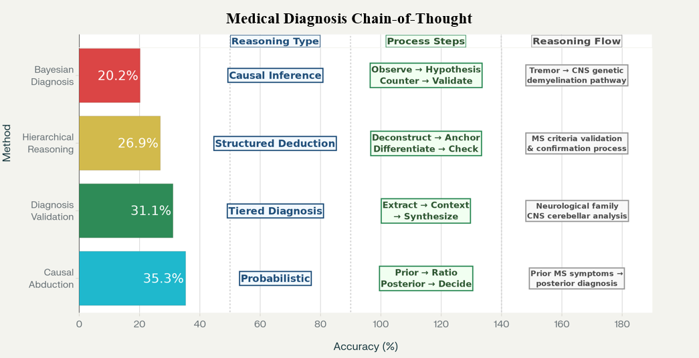

🎉 **Congratulations to our research team!** We are thrilled to announce that our paper "Enhancing Medical Diagnostic Reasoning with Chain-of-Thought in Large Language Models" has been awarded the **Best Paper Award** at the 2025 International Conference on Mechatronics, Robotics, and Artificial Intelligence (MRAI)!

<!--more-->

## 🌟 Award-Winning Research

Our research team, led by **Guangxin Dai**, **Xiang Li**, **Lizhou Fan**, and **Xin Ma**, has achieved a significant milestone in advancing medical AI technology. This groundbreaking work represents a major step forward in enhancing the diagnostic reasoning capabilities of Large Language Models (LLMs) in clinical settings.

## 🔬 Research Innovation

To address the critical challenge of improving diagnostic reasoning in AI-assisted healthcare, our team proposed four innovative Chain-of-Thought (CoT) prompting strategies:

1. **Diagnosis Validation** - Systematic validation of diagnostic hypotheses
2. **Bayesian Diagnosis** - Probabilistic reasoning approach for medical diagnosis
3. **Hierarchical Reasoning** - Multi-level diagnostic reasoning framework
4. **Causal Abduction** - Root cause analysis for medical conditions

Each CoT strategy was meticulously designed to emulate distinct modes of clinical reasoning that healthcare professionals use in real-world diagnostic scenarios.

## 📊 Experimental Results

Our comprehensive evaluation utilized GPT-3.5 and GPT-4o models, with rigorous testing on the MedQA-USMLE dataset. From an initial pool of 1597 questions, we identified 119 consistently error-prone questions to create a challenging benchmark for diagnostic reasoning.

**Key Performance Results on GPT-4o:**
- **Causal Abduction CoT**: Achieved the highest accuracy
- **Diagnosis Validation**: 31.1% accuracy improvement
- **Hierarchical Reasoning**: 26.9% accuracy enhancement
- **Bayesian Diagnosis**: Significant performance gains

## 🎯 Clinical Impact

The results demonstrate that clinical reasoning-oriented Chain-of-Thought prompting can effectively improve LLM performance on challenging diagnostic tasks. This breakthrough has significant implications for:

- **Enhanced Clinical Decision Support**: Better AI assistance for healthcare professionals
- **Improved Diagnostic Accuracy**: Reduced medical errors through advanced reasoning
- **Scalable Healthcare Solutions**: AI systems that can support medical practice globally

## 🚀 Future Directions

This award-winning research opens new avenues for advancing AI in healthcare. Our team continues to explore how Chain-of-Thought reasoning can be further refined and applied to various medical specialties, potentially revolutionizing how AI assists in clinical decision-making.

We extend our gratitude to the conference organizers, reviewers, and the broader research community for recognizing the significance of this work. This achievement motivates us to continue pushing the boundaries of AI in healthcare!
