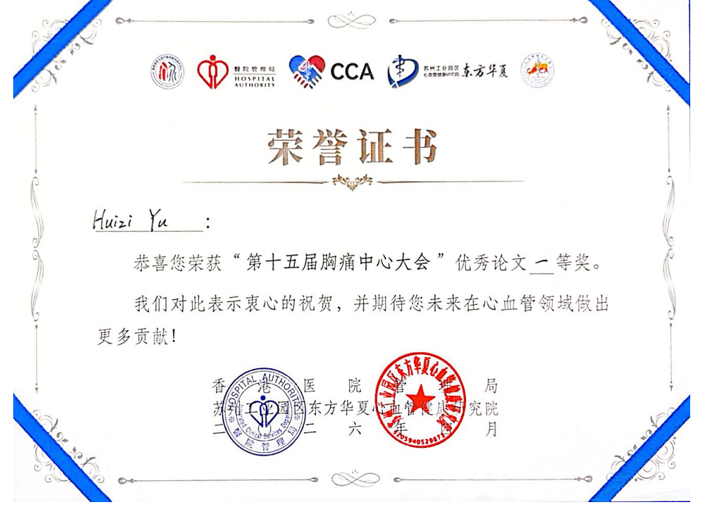

🎉 **Big News!** We are thrilled to announce that two of our research projects have been awarded the **First Prize for Excellent Paper** at the **15th Chest Pain Center Conference**! 

This prestigious conference is co-hosted by the **Hong Kong Hospital Authority** and the **Oriental Huaxia Cardiovascular Health Research Institute, Suzhou Industrial Park**. 🏅

---

## 🌟 Award-Winning Projects

This incredible honor recognizes our team's continuous effort and innovation in leveraging Artificial Intelligence to improve cardiovascular health and patient care. The two awarded projects are:

### 1️⃣ AI Copilot of Personalized Risk Education for Post-Revascularization Care in Patients with Coronary Artery Disease (CAD)
This project introduces an AI copilot designed to provide personalized risk education and care guidance for CAD patients who have undergone revascularization. It aims to improve long-term patient outcomes through tailored health management and advanced AI reasoning.

### 2️⃣ Clinically Aligned Hierarchical Machine Learning for Patient-Level Classification of Valvular Regurgitation Severity and Subtype from Phonocardiograms (PCG)
Focusing on non-invasive diagnostics, this research utilizes a novel clinically aligned hierarchical machine learning framework to accurately classify the severity and subtype of valvular regurgitation using Phonocardiogram (PCG) signals at the patient level.

  

---

  <i class="fas fa-quote-left" style="margin-right: 6px;"></i> Advancing AI for Cardiovascular Disease Management. 

